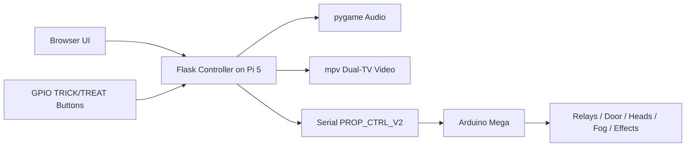

# Halloween Prop Controller

A network-connected Halloween attraction controller built on a Raspberry Pi 5 and an Arduino Mega. The system coordinates physical props, stereo audio, dual-screen video, GPIO trigger inputs, and a remote web control surface into one show-ready experience.

Current repository baseline: `v1.0`

This repository contains the full control stack for a TRICK/TREAT installation where:

- the Raspberry Pi acts as the show director
- the Arduino handles timing-critical relay logic
- operators can trigger and service the system from a browser
- two TVs run synchronized ambient and triggered visuals
- physical props, audio, and video stay coordinated through one workflow

## Overview

At a high level, the project turns a collection of props and media devices into one integrated attraction controller:

- web UI for remote operation and service controls
- GPIO dry-contact TRICK/TREAT buttons on the Pi
- stereo audio playback with a dedicated AutoTalk voice feed
- dual-HDMI video playback across two 1080p TVs
- Arduino scene execution for relays, pneumatics, and effects
- password-protected remote access for trusted operators
- serial reconnect and status recovery for better field reliability

## Why This Setup Works

The system is intentionally split into two layers:

- **Raspberry Pi 5**: orchestration, UI, audio, video, GPIO, serial management
- **Arduino Mega**: hard real-time-ish relay/output timing and safe hardware state transitions

That split keeps the prop timing stable while still allowing the show logic, web UI, and media stack to evolve quickly.

## System At A Glance

| Layer | Responsibility |
| --- | --- |
| Raspberry Pi 5 | Web UI, password auth, trigger handling, audio, dual-TV video, show flow, serial reconnect |
| Arduino Mega | Relay control, scene timing, output state reporting, STOP/RESET/ALL_OFF hardware safety |
| Browser UI | Operator controls, service toggles, scene tests, status visibility |
| Media Assets | Stereo audio cues plus side-by-side ambient/triggered video |

## Architecture



## Live Capabilities

- browser-based TRICK and TREAT operation
- service toggles for individual hardware outputs
- scene test controls for major effects
- quiet-time filtering for louder trick scenes
- serial health visibility through the API/UI
- automatic ambient TV playback during idle periods
- triggered TV playback at the end of completed show flows
- automatic end-cap `closing.mp3` playback after completed show audio, interruptible by the next trigger
- ambient timer reset after every completed show to prevent idle fog audio from colliding with show audio
- synchronized door + strobe behavior in the Arduino door sequence
- password-protected public-facing control endpoint

## Show Experience

The installation supports two operator-facing modes:

- **TRICK**: trick scene first, then door sequence, then triggered video
- **TREAT**: door sequence first, then final trick scene, then triggered video

This preserves the "no free candy" logic while keeping the audio, props, and TVs in one consistent sequence.

## Current Hardware Layout

### Arduino Mega Outputs

- `HEAD_1 / Skinny`: pin `4`
- `HEAD_2 / Hag`: pin `5`
- `AIR_CANNON`: pin `6`
- `AIR_TICKLER`: pin `7`
- `DOOR`: pin `8`
- `HORN / Ooga horn`: pin `9`
- `CRACKLER`: pin `10`
- `STROBE`: pin `13`
- `FOG`: pin `22`

### Raspberry Pi Trigger Inputs

The physical TRICK and TREAT buttons are dry-contact inputs to the Pi.

- `TRICK`: `GPIO17`, physical pin `11`
- `TREAT`: `GPIO27`, physical pin `13`
- ground: any Pi ground pin, commonly physical pin `9` or `14`

Internal pull-ups are enabled in software. Do not apply external voltage to these trigger lines.

## Show Flow

### TRICK

1. Choose a trick scene from the trick bag.
2. Play trick trigger audio and any matching head voice audio.
3. Run the chosen trick scene on the Arduino.
4. Play door audio.
5. Run the door sequence on the Arduino.
6. After the door sequence completes, play the triggered TV video.
7. After show audio finishes, play `closing.mp3` unless a newer show takes over.
8. Return to looping ambient TV video.

### TREAT

1. Play door audio and treat trigger audio together.
2. Run the door sequence on the Arduino.
3. Choose a trick scene from the same trick bag.
4. Play only the matching head voice audio for that trick scene.
5. Run the trick scene on the Arduino.
6. After that final trick completes, play the triggered TV video.
7. After show audio finishes, play `closing.mp3` unless a newer show takes over.
8. Return to looping ambient TV video.

`STOP`, `RESET`, and `ALL_OFF` cancel the active show, stop audio, force outputs off, and restore ambient TV playback.

## Reliability And Safety

The controller currently includes:

- serial port fallback across `/dev/ttyACM*` and `/dev/ttyUSB*`
- startup handshake with `SYS:PING` and `SYS:STATUS`
- automatic reconnect attempts after serial disconnect/error
- serial health state exposed through `/api/status`
- safe output reset behavior through `STOP`, `RESET`, and `ALL_OFF`
- GPIO trigger debounce control
- app-managed ambient video recovery
- repo-managed Pi display session configuration for a clean black fallback desktop
- long-lived password-authenticated browser sessions

## Quiet Time

Quiet time is supported in the app and configurable from the UI/settings API.

Default quiet window in the repo:

- start: `21:00`
- end: `08:00`

During quiet time, the trick bag excludes:

- `TRICK_HORN`
- `TRICK_CRACKLER`
- `TRICK_AIR_CANNON`

## Audio Layout

Audio files in `audio/` are stereo files with a split channel design:

- left channel: non-voice show audio / speaker feed
- right channel: voice feed for ServoDMX AutoTalk

Do not mono-sum the channels together. That would send non-voice effects into AutoTalk and voice cues into the general speaker feed.

On startup, the app requests `100%` system output volume by default so final loudness can be adjusted downstream on the speakers/amp.

Current active audio tracks:

- `welcome.mp3` for idle fog/ambient moments
- `door.mp3` during the door sequence
- `trick.mp3` for TRICK trigger audio
- `treat.mp3` for TREAT trigger audio
- `skinny.mp3` and `hag.mp3` for the matching head voices
- `closing.mp3` after a completed show, interruptible by the next show

## TV Video System

The Pi 5 drives two identical `1920x1080` TVs from its dual HDMI outputs.

The app uses one combined side-by-side video for each state:

- `video/ambient.mp4`: looping idle video
- `video/triggered.mp4`: one-shot triggered video

Each video is formatted as a single `3840x1080` file:

- left half = left TV
- right half = right TV

The app launches `mpv` on the Pi in the active X11 desktop session and manages the transition between ambient and triggered playback.

Current deployed display approach:

- Raspberry Pi OS 64-bit with desktop packages installed
- LightDM autologin into `LXDE-pi-x`
- X11 desktop extended across both displays
- `/home/candydisp/dual-tv-layout.sh` applies the `3840x1080` layout on login
- LXDE session stripped down to a black fallback desktop with no wallpaper panel or desktop-manager chrome

Repo-managed Pi display session files:

- `tools/pi/lxsession/LXDE-pi/autostart`
- `tools/pi/apply_display_session.sh`

## Serial Protocol

Protocol version: `PROP_CTRL_V2`

Pi to Arduino:

- `RUN:<scene>`
- `TOGGLE:<output>`
- `SYS:<command>`

Arduino to Pi:

- `READY:PROP_CTRL_V2`
- `STATUS:<state>`
- `STATUS:RUNNING_SCENE:<scene>`
- `STATUS:RUNNING_SERVICE:<output>`
- `STATE:<output>:ON`
- `STATE:<output>:OFF`
- `DONE:<command>`
- `ERROR:<reason>`

`SYS:STATUS` reports the current system state, every output state, and ends with `DONE:SYS:STATUS`.

## Important Files

- `app.py`: main controller app
- `arduino/firmware/firmware.ino`: Arduino Mega firmware
- `audio/`: audio assets
- `video/`: combined dual-screen video assets
- `tests/test_controller_logic.py`: controller behavior tests
- `tests/test_flask_routes.py`: route/auth tests
- `tests/test_protocol_contract.py`: Python/firmware protocol contract tests
- `handoff.txt`: condensed technical handoff

## Pi Setup Notes

### Python Dependencies

On the Pi:

```bash
python3 -m venv --system-site-packages venv
source venv/bin/activate
pip install -r requirements.txt
```

For Pi GPIO support, prefer apt packages over building `lgpio` from pip:

```bash
sudo apt install -y python3-gpiozero python3-lgpio
```

### Service

The controller is intended to run through:

```text
/etc/systemd/system/halloween.service
```

Typical service behavior:

- starts the Flask app
- connects to the Arduino
- enables GPIO triggers
- starts ambient video playback

### Connectivity Recovery

The app exposes unauthenticated health endpoints for local watchdogs and remote
uptime checks:

- `GET /healthz`: lightweight Flask liveness check
- `GET /readyz`: limited controller readiness snapshot

The Pi bootstrap also installs:

```text
/etc/systemd/system/halloween-network-watchdog.service
/etc/systemd/system/halloween-network-watchdog.timer
/usr/local/bin/halloween-network-watchdog.sh
```

The timer runs once per minute. It leaves `halloween.service` running by
default so the active show/screens are not interrupted, disables WiFi power save
when supported, and restarts the Pi network stack after repeated failed
gateway/internet pings. Local app health failures are logged through systemd
journals; set `HALLOWEEN_RESTART_APP_ON_HEALTH_FAILURE=1` only if you want the
watchdog to restart the show app too.

Useful commands on the Pi:

```bash
systemctl status halloween-network-watchdog.timer
journalctl -u halloween-network-watchdog.service -n 80 --no-pager
curl -fsS http://127.0.0.1:5000/healthz
```

If the Pi uses a network interface other than `wlan0`, edit
`HALLOWEEN_NET_IFACE` in `/etc/systemd/system/halloween-network-watchdog.service`
and run:

```bash
sudo systemctl daemon-reload
sudo systemctl restart halloween-network-watchdog.timer
```

### Display Session

To re-apply the minimal dual-TV desktop session on the Pi:

```bash
bash tools/pi/apply_display_session.sh
```

This installs the repo-managed LXDE autostart file that:

- applies the dual-TV layout
- sets a black root background
- keeps the cursor hidden
- avoids desktop panels and wallpaper showing during video transitions

## Deployment Notes

The repository is structured so the same codebase can support:

- local development on Windows or other non-Pi systems
- mock Arduino testing
- Raspberry Pi deployment with live GPIO/audio/video/serial hardware

On non-Pi development systems, video playback is disabled by default so the local environment does not try to launch the Pi display stack.

### Video/Desktop Requirements

The current dual-TV playback depends on:

- LightDM enabled
- autologin user session set to `LXDE-pi-x`
- both TVs configured as `1920x1080`
- extended X11 desktop spanning both outputs
- `mpv` available on the Pi

## Local Development

Install dependencies:

```bash
pip install -r requirements.txt
```

Run the test suite:

```bash
python -m unittest discover -s tests -v
```

Syntax check:

```bash
python -m py_compile app.py
```

Run locally:

```bash
python app.py
```

## Environment Variables

Common runtime overrides:

- `HALLOWEEN_SERIAL_PORT`
- `HALLOWEEN_USE_MOCK_ARDUINO`
- `HALLOWEEN_MOCK_SCENE_DELAY_SCALE`
- `HALLOWEEN_GPIO_DISABLED`
- `HALLOWEEN_TRICK_GPIO`
- `HALLOWEEN_TREAT_GPIO`
- `HALLOWEEN_GPIO_BOUNCE_TIME`
- `HALLOWEEN_SET_SYSTEM_VOLUME`
- `HALLOWEEN_SYSTEM_VOLUME`
- `HALLOWEEN_ACCESS_PASSWORD`
- `HALLOWEEN_SECRET_KEY`
- `HALLOWEEN_SESSION_DAYS`
- `HALLOWEEN_VIDEO_DISABLED`
- `HALLOWEEN_VIDEO_PLAYER`
- `HALLOWEEN_VIDEO_DISPLAY`
- `HALLOWEEN_VIDEO_XAUTHORITY`
- `HALLOWEEN_VIDEO_AMBIENT_FILE`
- `HALLOWEEN_VIDEO_TRIGGERED_FILE`

## Design Rules

- keep timing-critical relay logic on the Arduino
- keep Flask responsive
- preserve STOP responsiveness
- keep Python and firmware protocol compatibility aligned
- treat the Pi as the show orchestrator and the Arduino as the hardware executor

## Status

This repository reflects the current working architecture of the live system, including:

- Arduino Mega prop control
- Pi-hosted Flask control UI
- serial reconnect and state recovery
- password-protected remote access
- stereo split audio routing
- dual-TV ambient and triggered video playback
- closing-audio show tail behavior
- repo-tracked Pi display session configuration
